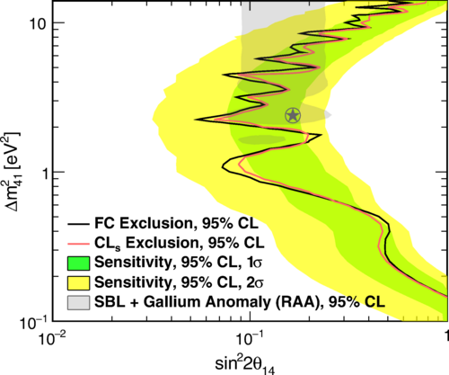

##### Abstract

We present a detailed report on sterile neutrino oscillation and 235U $\overline{\nu}_e$ energy spectrum measurement results from the PROSPECT 
experiment at the highly enriched High Flux Isotope Reactor (HFIR) at Oak Ridge National Laboratory. In 96 calendar days of data taken at an average
baseline distance of 7.9 m from the center of the 85 MW HFIR core, the PROSPECT detector has observed more than 50,000 interactions of 
$\overline{\nu}_e$ produced in beta decays of 235U fission products. New limits on the oscillation of $\overline{\nu}_e$ to light sterile neutrinos
have been set by comparing the detected energy spectra of ten reactor-detector baselines between 6.7 and 9.2 meters. Measured differences in energy
spectra between baselines show no statistically significant indication of $\overline{\nu}_e$ to sterile neutrino oscillation and disfavor the 
reactor antineutrino anomaly best-fit point at the 2.5σ confidence level. The reported 235U $\overline{\nu}_e$ energy spectrum measurement shows 
excellent agreement with energy spectrum models generated via conversion of the measured 235U beta spectrum, with a χ2/d.o.f. of 31/31. PROSPECT is 
able to disfavor at 2.4σ confidence level the hypothesis that 235U $\overline{\nu}_e$ are solely responsible for spectrum discrepancies between 
model and data obtained at commercial reactor cores. A data-model deviation in PROSPECT similar to that observed by commercial core experiments is 
preferred with respect to no observed deviation, at a 2.2σ confidence level.


---

##### Figure 48: Oscillation exclusion contours derived using the Gaussian CLs and FC methods.


---

##### Citation

```BibTeX
@article{PROSPECT:2020sxr,
    author = "Andriamirado, M. and others",
    collaboration = "PROSPECT",
    title = "{Improved short-baseline neutrino oscillation search and energy spectrum measurement with the PROSPECT experiment at HFIR}",
    eprint = "2006.11210",
    archivePrefix = "arXiv",
    primaryClass = "hep-ex",
    doi = "10.1103/PhysRevD.103.032001",
    journal = "Phys. Rev. D",
    volume = "103",
    number = "3",
    pages = "032001",
    year = "2021"
}

```

---

##### Presentations

+ [Neutrino 2020](presentation1.pdf)

